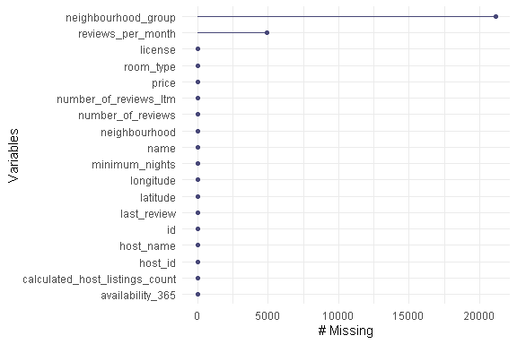
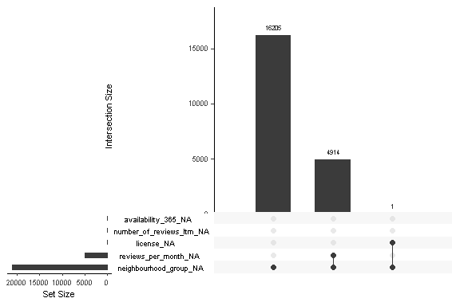
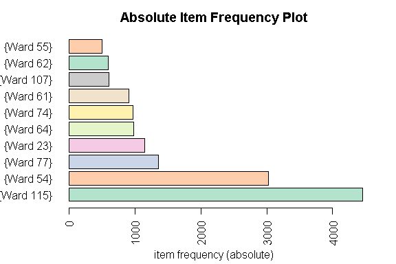
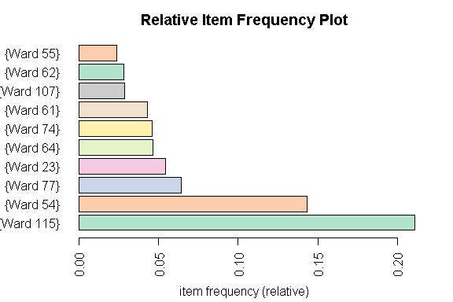
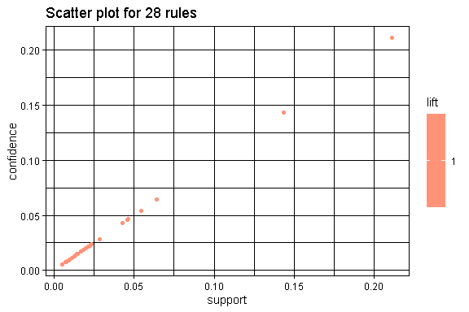
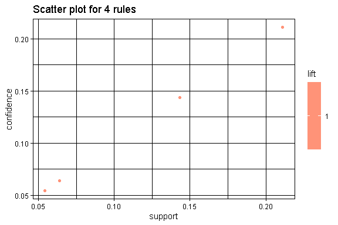
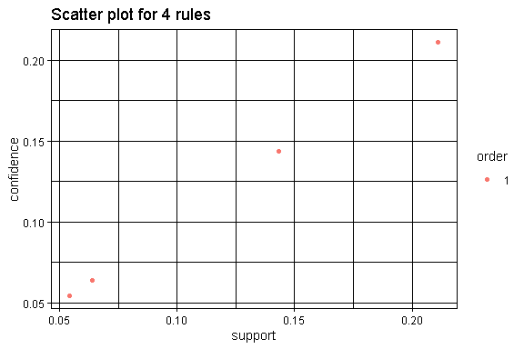
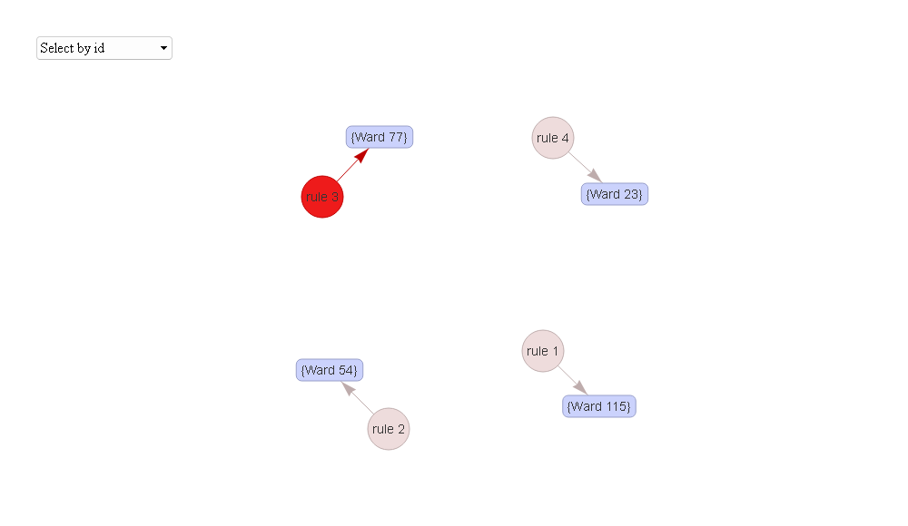

Business Intelligence Project
================
<Specify your name here>
<Specify the date when you submitted the lab>

- [Student Details](#student-details)
- [Setup Chunk](#setup-chunk)
- [Association Rule Learning](#association-rule-learning)
- [Load and pre-process the dataset](#load-and-pre-process-the-dataset)
  - [FORMAT 1: Single Format](#format-1-single-format)
  - [FORMAT 2: Basket Format](#format-2-basket-format)
  - [Dataset loader](#dataset-loader)
  - [Handle missing values](#handle-missing-values)
    - [Are there missing values in the
      dataset?](#are-there-missing-values-in-the-dataset)
    - [How many?](#how-many)
    - [What is the proportion of missing data in the entire
      dataset?](#what-is-the-proportion-of-missing-data-in-the-entire-dataset)
    - [What is the number and percentage of missing values grouped by
      each
      variable?](#what-is-the-number-and-percentage-of-missing-values-grouped-by-each-variable)
    - [Which variables contain the most missing
      values?](#which-variables-contain-the-most-missing-values)
    - [Which combinations of variables are missing
      together?](#which-combinations-of-variables-are-missing-together)
  - [Remove the variables with missing
    values](#remove-the-variables-with-missing-values)
    - [Save progress](#save-progress)
- [Create a transaction data using the “basket
  format”](#create-a-transaction-data-using-the-basket-format)
  - [Record only the `items` variable](#record-only-the-items-variable)
  - [Save the transactions in CSV
    format](#save-the-transactions-in-csv-format)
  - [Read the transactions from the CSV
    file](#read-the-transactions-from-the-csv-file)
  - [Basic EDA](#basic-eda)
    - [Create the association rules](#create-the-association-rules)
    - [Find specific rules](#find-specific-rules)
    - [Visualize the rules](#visualize-the-rules)

# Student Details

|                                              |                             |
|----------------------------------------------|-----------------------------|
| **Student ID Number**                        | 119630,135844,131038,104135 |
| **Student Name**                             | beasts                      |
| **BBIT 4.2 Group**                           | A&B&C                       |
| **BI Project Group Name/ID (if applicable)** | beasts                      |

# Setup Chunk

**Note:** the following KnitR options have been set as the global
defaults: <BR>
`knitr::opts_chunk$set(echo = TRUE, warning = FALSE, eval = TRUE, collapse = FALSE, tidy = TRUE)`.

More KnitR options are documented here
<https://bookdown.org/yihui/rmarkdown-cookbook/chunk-options.html> and
here <https://yihui.org/knitr/options/>.

# Association Rule Learning

# Load and pre-process the dataset

### FORMAT 1: Single Format

``` r
library(arules)
```

    ## Loading required package: Matrix

    ## 
    ## Attaching package: 'arules'

    ## The following objects are masked from 'package:base':
    ## 
    ##     abbreviate, write

``` r
transactions_single_format_listings <- read.transactions("data/transactions_single_format.csv", format = "single", cols = c(1, 2))

summary(transactions_single_format_listings)  # Summary of the transactions
```

    ## transactions as itemMatrix in sparse format with
    ##  7 rows (elements/itemsets/transactions) and
    ##  3 columns (items) and a density of 0.3333333 
    ## 
    ## most frequent items:
    ##    item3,    item3} 1,{item1,   (Other) 
    ##         4         2         1         0 
    ## 
    ## element (itemset/transaction) length distribution:
    ## sizes
    ## 1 
    ## 7 
    ## 
    ##    Min. 1st Qu.  Median    Mean 3rd Qu.    Max. 
    ##       1       1       1       1       1       1 
    ## 
    ## includes extended item information - examples:
    ##      labels
    ## 1 1,{item1,
    ## 2    item3,
    ## 3    item3}
    ## 
    ## includes extended transaction information - examples:
    ##   transactionID
    ## 1     2,{item2,
    ## 2     3,{item1,
    ## 3     4,{item1,

``` r
inspect(transactions_single_format_listings)  # View the transactions
```

    ##     items       transactionID
    ## [1] {item3,}    2,{item2,    
    ## [2] {item3,}    3,{item1,    
    ## [3] {item3,}    4,{item1,    
    ## [4] {item3,}    5,{item1,    
    ## [5] {item3}}    6,{item1,    
    ## [6] {item3}}    7,{item1,    
    ## [7] {1,{item1,} TID,items

### FORMAT 2: Basket Format

``` r
transactions_basket_format_listings <-
  read.transactions("data/transactions_basket_format.csv",
                    format = "basket", sep = ",", cols = 2)
summary(transactions_basket_format_listings)  # Summary of the transactions
```

    ## transactions as itemMatrix in sparse format with
    ##  20 rows (elements/itemsets/transactions) and
    ##  8 columns (items) and a density of 0.125 
    ## 
    ## most frequent items:
    ##       1       2       3       4       5 (Other) 
    ##       3       3       3       3       3       5 
    ## 
    ## element (itemset/transaction) length distribution:
    ## sizes
    ##  1 
    ## 20 
    ## 
    ##    Min. 1st Qu.  Median    Mean 3rd Qu.    Max. 
    ##       1       1       1       1       1       1 
    ## 
    ## includes extended item information - examples:
    ##   labels
    ## 1      1
    ## 2      2
    ## 3      3
    ## 
    ## includes extended transaction information - examples:
    ##   transactionID
    ## 1          item
    ## 2         item1
    ## 3         item2

``` r
inspect(transactions_basket_format_listings)  # View the transactions
```

    ##      items transactionID
    ## [1]  {TID} item         
    ## [2]  {1}   item1        
    ## [3]  {1}   item2        
    ## [4]  {1}   item3        
    ## [5]  {2}   item2        
    ## [6]  {2}   item3        
    ## [7]  {2}   item4        
    ## [8]  {3}   item1        
    ## [9]  {3}   item3        
    ## [10] {3}   item5        
    ## [11] {4}   item1        
    ## [12] {4}   item3        
    ## [13] {4}   item5        
    ## [14] {5}   item1        
    ## [15] {5}   item3        
    ## [16] {5}   item5        
    ## [17] {6}   item1        
    ## [18] {6}   item3        
    ## [19] {7}   item1        
    ## [20] {7}   item3

### Dataset loader

``` r
listings <- read.csv("data/listings_summary_cape_town.csv")
```

## Handle missing values

### Are there missing values in the dataset?

``` r
library(naniar)
any_na(listings)
```

    ## [1] TRUE

### How many?

``` r
n_miss(listings)
```

    ## [1] 26035

### What is the proportion of missing data in the entire dataset?

``` r
prop_miss(listings)
```

    ## [1] 0.06848432

### What is the number and percentage of missing values grouped by each variable?

``` r
miss_var_summary(listings)
```

    ## # A tibble: 18 × 3
    ##    variable                       n_miss  pct_miss
    ##    <chr>                           <int>     <dbl>
    ##  1 neighbourhood_group             21120 100      
    ##  2 reviews_per_month                4914  23.3    
    ##  3 license                             1   0.00473
    ##  4 id                                  0   0      
    ##  5 name                                0   0      
    ##  6 host_id                             0   0      
    ##  7 host_name                           0   0      
    ##  8 neighbourhood                       0   0      
    ##  9 latitude                            0   0      
    ## 10 longitude                           0   0      
    ## 11 room_type                           0   0      
    ## 12 price                               0   0      
    ## 13 minimum_nights                      0   0      
    ## 14 number_of_reviews                   0   0      
    ## 15 last_review                         0   0      
    ## 16 calculated_host_listings_count      0   0      
    ## 17 availability_365                    0   0      
    ## 18 number_of_reviews_ltm               0   0

### Which variables contain the most missing values?

``` r
gg_miss_var(listings)
```

<!-- -->

### Which combinations of variables are missing together?

``` r
gg_miss_upset(listings)
```

<!-- -->

## Remove the variables with missing values

``` r
listings_removed_vars <-
  listings %>% dplyr::select(-neighbourhood_group, -reviews_per_month, -license, -last_review )

dim(listings_removed_vars)
```

    ## [1] 21120    14

``` r
# Are there missing values in the dataset?
any_na(listings_removed_vars)
```

    ## [1] FALSE

``` r
# What is the number and percentage of missing values grouped by each variable?
miss_var_summary(listings_removed_vars)
```

    ## # A tibble: 14 × 3
    ##    variable                       n_miss pct_miss
    ##    <chr>                           <int>    <dbl>
    ##  1 id                                  0        0
    ##  2 name                                0        0
    ##  3 host_id                             0        0
    ##  4 host_name                           0        0
    ##  5 neighbourhood                       0        0
    ##  6 latitude                            0        0
    ##  7 longitude                           0        0
    ##  8 room_type                           0        0
    ##  9 price                               0        0
    ## 10 minimum_nights                      0        0
    ## 11 number_of_reviews                   0        0
    ## 12 calculated_host_listings_count      0        0
    ## 13 availability_365                    0        0
    ## 14 number_of_reviews_ltm               0        0

``` r
#Identify categorical variables
str(listings_removed_vars)
```

    ## 'data.frame':    21120 obs. of  14 variables:
    ##  $ id                            : num  3191 15007 15077 15199 15285 ...
    ##  $ name                          : chr  "Home in Southern Suburbs · ★4.81 · 1 bedroom · 1 bed · 1 bath" "Home in Cape Town · ★4.82 · 3 bedrooms · 4 beds · 3 baths" "Rental unit in Tableview - Sunset Beach · ★5.0 · 1 bedroom · 2 beds · 1.5 baths" "Rental unit in Cape Town · 1 bedroom · 1 bed · 1 bath" ...
    ##  $ host_id                       : int  3754 59072 59342 59694 59964 60196 60443 61441 63255 71221 ...
    ##  $ host_name                     : chr  "Brigitte" "Dirk" "Georg" "Alexa" ...
    ##  $ neighbourhood                 : chr  "Ward 57" "Ward 23" "Ward 4" "Ward 115" ...
    ##  $ latitude                      : num  -33.9 -33.8 -33.9 -33.9 -34 ...
    ##  $ longitude                     : num  18.5 18.5 18.5 18.4 18.4 ...
    ##  $ room_type                     : chr  "Entire home/apt" "Entire home/apt" "Private room" "Entire home/apt" ...
    ##  $ price                         : int  696 3187 1102 2500 1714 650 690 24224 950 1110 ...
    ##  $ minimum_nights                : int  3 2 2 14 2 3 30 4 2 7 ...
    ##  $ number_of_reviews             : int  74 45 7 2 11 0 23 2 16 0 ...
    ##  $ calculated_host_listings_count: int  1 2 6 1 3 1 1 5 3 1 ...
    ##  $ availability_365              : int  325 282 142 365 0 0 205 305 263 0 ...
    ##  $ number_of_reviews_ltm         : int  7 7 0 0 0 0 0 1 0 0 ...

### Save progress

We can save the pre-processing progress made so far

``` r
write.csv(listings_removed_vars, file = "data/listings_data_before_single_transaction_format.csv", row.names = FALSE)

listings_removed_vars <- read.csv(file = "data/listings_data_before_single_transaction_format.csv")
```

# Create a transaction data using the “basket format”

``` r
transaction_data_listings <-
  plyr::ddply(listings_removed_vars,
    c("id","name", "price"),
    function(df1) paste(df1$neighbourhood, collapse = ","))

View(transaction_data_listings)
```

### Record only the `items` variable

``` r
library(dplyr)
```

    ## 
    ## Attaching package: 'dplyr'

    ## The following objects are masked from 'package:arules':
    ## 
    ##     intersect, recode, setdiff, setequal, union

    ## The following objects are masked from 'package:stats':
    ## 
    ##     filter, lag

    ## The following objects are masked from 'package:base':
    ## 
    ##     intersect, setdiff, setequal, union

``` r
transaction_data_listings <-
  transaction_data_listings %>%
  dplyr::select("items" = V1)%>% 
  mutate(items = paste("{", items, "}", sep = ""))

View(transaction_data_listings)
```

### Save the transactions in CSV format

``` r
write.csv(transaction_data_listings,
          "data/transactions_basket_format_listings.csv",
          quote = FALSE, row.names = FALSE)
```

### Read the transactions from the CSV file

``` r
tr_listings <-
  read.transactions("data/transactions_basket_format_listings.csv",
    format = "basket",
    header = TRUE,
    rm.duplicates = TRUE,
    sep = ","
  )

print(tr_listings)
```

    ## transactions in sparse format with
    ##  21120 transactions (rows) and
    ##  92 items (columns)

``` r
summary(tr_listings)
```

    ## transactions as itemMatrix in sparse format with
    ##  21120 rows (elements/itemsets/transactions) and
    ##  92 columns (items) and a density of 0.01086957 
    ## 
    ## most frequent items:
    ## {Ward 115}  {Ward 54}  {Ward 77}  {Ward 23}  {Ward 64}    (Other) 
    ##       4459       3030       1354       1149        983      10145 
    ## 
    ## element (itemset/transaction) length distribution:
    ## sizes
    ##     1 
    ## 21120 
    ## 
    ##    Min. 1st Qu.  Median    Mean 3rd Qu.    Max. 
    ##       1       1       1       1       1       1 
    ## 
    ## includes extended item information - examples:
    ##       labels
    ## 1   {Ward 1}
    ## 2  {Ward 10}
    ## 3 {Ward 100}

## Basic EDA

``` r
library(RColorBrewer)

itemFrequencyPlot(tr_listings, topN = 10, type = "absolute",
                  col = brewer.pal(8, "Pastel2"),
                  main = "Absolute Item Frequency Plot",
                  horiz = TRUE,
                  mai = c(0.85, 1, 0.5, 0.5))
```

<!-- -->

``` r
itemFrequencyPlot(tr_listings, topN = 10, type = "relative",
                  col = brewer.pal(8, "Pastel2"),
                  main = "Relative Item Frequency Plot",
                  horiz = TRUE,
                  mai = c(0.85, 1, 0.5, 0.5))
```

<!-- -->

### Create the association rules

``` r
library(arulesViz)
association_rules_listings <- apriori(tr_listings,
                             parameter = list(support = 0.001, # Increase support threshold
                                              confidence = 0.005,
                                              maxlen = 10)) # Reduce the maximum length of rules
```

    ## Apriori
    ## 
    ## Parameter specification:
    ##  confidence minval smax arem  aval originalSupport maxtime support minlen
    ##       0.005    0.1    1 none FALSE            TRUE       5   0.001      1
    ##  maxlen target  ext
    ##      10  rules TRUE
    ## 
    ## Algorithmic control:
    ##  filter tree heap memopt load sort verbose
    ##     0.1 TRUE TRUE  FALSE TRUE    2    TRUE
    ## 
    ## Absolute minimum support count: 21 
    ## 
    ## set item appearances ...[0 item(s)] done [0.00s].
    ## set transactions ...[92 item(s), 21120 transaction(s)] done [0.00s].
    ## sorting and recoding items ... [49 item(s)] done [0.00s].
    ## creating transaction tree ... done [0.00s].
    ## checking subsets of size 1 done [0.00s].
    ## writing ... [28 rule(s)] done [0.00s].
    ## creating S4 object  ... done [0.00s].

``` r
#Print the association rules to view the top 10 rules
summary(association_rules_listings)
```

    ## set of 28 rules
    ## 
    ## rule length distribution (lhs + rhs):sizes
    ##  1 
    ## 28 
    ## 
    ##    Min. 1st Qu.  Median    Mean 3rd Qu.    Max. 
    ##       1       1       1       1       1       1 
    ## 
    ## summary of quality measures:
    ##     support           confidence          coverage      lift       count       
    ##  Min.   :0.005445   Min.   :0.005445   Min.   :1   Min.   :1   Min.   : 115.0  
    ##  1st Qu.:0.012524   1st Qu.:0.012524   1st Qu.:1   1st Qu.:1   1st Qu.: 264.5  
    ##  Median :0.019342   Median :0.019342   Median :1   Median :1   Median : 408.5  
    ##  Mean   :0.033582   Mean   :0.033582   Mean   :1   Mean   :1   Mean   : 709.2  
    ##  3rd Qu.:0.032185   3rd Qu.:0.032185   3rd Qu.:1   3rd Qu.:1   3rd Qu.: 679.8  
    ##  Max.   :0.211127   Max.   :0.211127   Max.   :1   Max.   :1   Max.   :4459.0  
    ## 
    ## mining info:
    ##         data ntransactions support confidence
    ##  tr_listings         21120   0.001      0.005
    ##                                                                                             call
    ##  apriori(data = tr_listings, parameter = list(support = 0.001, confidence = 0.005, maxlen = 10))

``` r
inspect(association_rules_listings)
```

    ##      lhs    rhs          support     confidence  coverage lift count
    ## [1]  {}  => {{Ward 112}} 0.005445076 0.005445076 1        1     115 
    ## [2]  {}  => {{Ward 2}}   0.007528409 0.007528409 1        1     159 
    ## [3]  {}  => {{Ward 21}}  0.008001894 0.008001894 1        1     169 
    ## [4]  {}  => {{Ward 53}}  0.008096591 0.008096591 1        1     171 
    ## [5]  {}  => {{Ward 70}}  0.009375000 0.009375000 1        1     198 
    ## [6]  {}  => {{Ward 1}}   0.009706439 0.009706439 1        1     205 
    ## [7]  {}  => {{Ward 73}}  0.011316288 0.011316288 1        1     239 
    ## [8]  {}  => {{Ward 71}}  0.012926136 0.012926136 1        1     273 
    ## [9]  {}  => {{Ward 4}}   0.013162879 0.013162879 1        1     278 
    ## [10] {}  => {{Ward 83}}  0.013304924 0.013304924 1        1     281 
    ## [11] {}  => {{Ward 113}} 0.014678030 0.014678030 1        1     310 
    ## [12] {}  => {{Ward 84}}  0.015056818 0.015056818 1        1     318 
    ## [13] {}  => {{Ward 58}}  0.016998106 0.016998106 1        1     359 
    ## [14] {}  => {{Ward 100}} 0.018418561 0.018418561 1        1     389 
    ## [15] {}  => {{Ward 15}}  0.020265152 0.020265152 1        1     428 
    ## [16] {}  => {{Ward 57}}  0.021543561 0.021543561 1        1     455 
    ## [17] {}  => {{Ward 69}}  0.021875000 0.021875000 1        1     462 
    ## [18] {}  => {{Ward 59}}  0.023058712 0.023058712 1        1     487 
    ## [19] {}  => {{Ward 55}}  0.023768939 0.023768939 1        1     502 
    ## [20] {}  => {{Ward 62}}  0.028456439 0.028456439 1        1     601 
    ## [21] {}  => {{Ward 107}} 0.028598485 0.028598485 1        1     604 
    ## [22] {}  => {{Ward 61}}  0.042945076 0.042945076 1        1     907 
    ## [23] {}  => {{Ward 74}}  0.046117424 0.046117424 1        1     974 
    ## [24] {}  => {{Ward 64}}  0.046543561 0.046543561 1        1     983 
    ## [25] {}  => {{Ward 23}}  0.054403409 0.054403409 1        1    1149 
    ## [26] {}  => {{Ward 77}}  0.064109848 0.064109848 1        1    1354 
    ## [27] {}  => {{Ward 54}}  0.143465909 0.143465909 1        1    3030 
    ## [28] {}  => {{Ward 115}} 0.211126894 0.211126894 1        1    4459

``` r
# To view the top 10 rules
inspect(association_rules_listings)
```

    ##      lhs    rhs          support     confidence  coverage lift count
    ## [1]  {}  => {{Ward 112}} 0.005445076 0.005445076 1        1     115 
    ## [2]  {}  => {{Ward 2}}   0.007528409 0.007528409 1        1     159 
    ## [3]  {}  => {{Ward 21}}  0.008001894 0.008001894 1        1     169 
    ## [4]  {}  => {{Ward 53}}  0.008096591 0.008096591 1        1     171 
    ## [5]  {}  => {{Ward 70}}  0.009375000 0.009375000 1        1     198 
    ## [6]  {}  => {{Ward 1}}   0.009706439 0.009706439 1        1     205 
    ## [7]  {}  => {{Ward 73}}  0.011316288 0.011316288 1        1     239 
    ## [8]  {}  => {{Ward 71}}  0.012926136 0.012926136 1        1     273 
    ## [9]  {}  => {{Ward 4}}   0.013162879 0.013162879 1        1     278 
    ## [10] {}  => {{Ward 83}}  0.013304924 0.013304924 1        1     281 
    ## [11] {}  => {{Ward 113}} 0.014678030 0.014678030 1        1     310 
    ## [12] {}  => {{Ward 84}}  0.015056818 0.015056818 1        1     318 
    ## [13] {}  => {{Ward 58}}  0.016998106 0.016998106 1        1     359 
    ## [14] {}  => {{Ward 100}} 0.018418561 0.018418561 1        1     389 
    ## [15] {}  => {{Ward 15}}  0.020265152 0.020265152 1        1     428 
    ## [16] {}  => {{Ward 57}}  0.021543561 0.021543561 1        1     455 
    ## [17] {}  => {{Ward 69}}  0.021875000 0.021875000 1        1     462 
    ## [18] {}  => {{Ward 59}}  0.023058712 0.023058712 1        1     487 
    ## [19] {}  => {{Ward 55}}  0.023768939 0.023768939 1        1     502 
    ## [20] {}  => {{Ward 62}}  0.028456439 0.028456439 1        1     601 
    ## [21] {}  => {{Ward 107}} 0.028598485 0.028598485 1        1     604 
    ## [22] {}  => {{Ward 61}}  0.042945076 0.042945076 1        1     907 
    ## [23] {}  => {{Ward 74}}  0.046117424 0.046117424 1        1     974 
    ## [24] {}  => {{Ward 64}}  0.046543561 0.046543561 1        1     983 
    ## [25] {}  => {{Ward 23}}  0.054403409 0.054403409 1        1    1149 
    ## [26] {}  => {{Ward 77}}  0.064109848 0.064109848 1        1    1354 
    ## [27] {}  => {{Ward 54}}  0.143465909 0.143465909 1        1    3030 
    ## [28] {}  => {{Ward 115}} 0.211126894 0.211126894 1        1    4459

``` r
plot(association_rules_listings)
```

<!-- -->

### Find specific rules

``` r
ward_association_rules <- # nolint
  apriori(tr_listings, parameter = list(supp = 0.001, conf = 0.05),
          appearance = list(default = "rhs",
                            rhs = "{Ward 100}"))
```

    ## Apriori
    ## 
    ## Parameter specification:
    ##  confidence minval smax arem  aval originalSupport maxtime support minlen
    ##        0.05    0.1    1 none FALSE            TRUE       5   0.001      1
    ##  maxlen target  ext
    ##      10  rules TRUE
    ## 
    ## Algorithmic control:
    ##  filter tree heap memopt load sort verbose
    ##     0.1 TRUE TRUE  FALSE TRUE    2    TRUE
    ## 
    ## Absolute minimum support count: 21 
    ## 
    ## set item appearances ...[1 item(s)] done [0.00s].
    ## set transactions ...[92 item(s), 21120 transaction(s)] done [0.00s].
    ## sorting and recoding items ... [49 item(s)] done [0.00s].
    ## creating transaction tree ... done [0.00s].
    ## checking subsets of size 1 done [0.00s].
    ## writing ... [4 rule(s)] done [0.00s].
    ## creating S4 object  ... done [0.00s].

``` r
inspect(head(ward_association_rules))
```

    ##     lhs    rhs          support    confidence coverage lift count
    ## [1] {}  => {{Ward 23}}  0.05440341 0.05440341 1        1    1149 
    ## [2] {}  => {{Ward 77}}  0.06410985 0.06410985 1        1    1354 
    ## [3] {}  => {{Ward 54}}  0.14346591 0.14346591 1        1    3030 
    ## [4] {}  => {{Ward 115}} 0.21112689 0.21112689 1        1    4459

### Visualize the rules

``` r
rules_to_plot <-
  association_rules_listings[quality(association_rules_listings)$confidence > 0.05] # nolint
#Plot SubRules
plot(rules_to_plot)
```

<!-- -->

``` r
plot(rules_to_plot, method = "two-key plot")
```

<!-- -->

``` r
top_10_rules_to_plot <- head(rules_to_plot, n = 10, by = "confidence")
plot(top_10_rules_to_plot, method = "graph",  engine = "htmlwidget")
```

<!-- -->

``` r
saveAsGraph(head(rules_to_plot, n = 1000, by = "lift"),
            file = "graph/association_rules_prod_no_reps.graphml")
```
